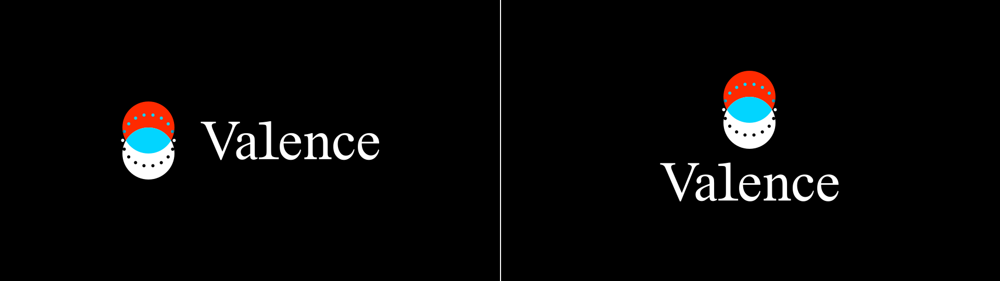
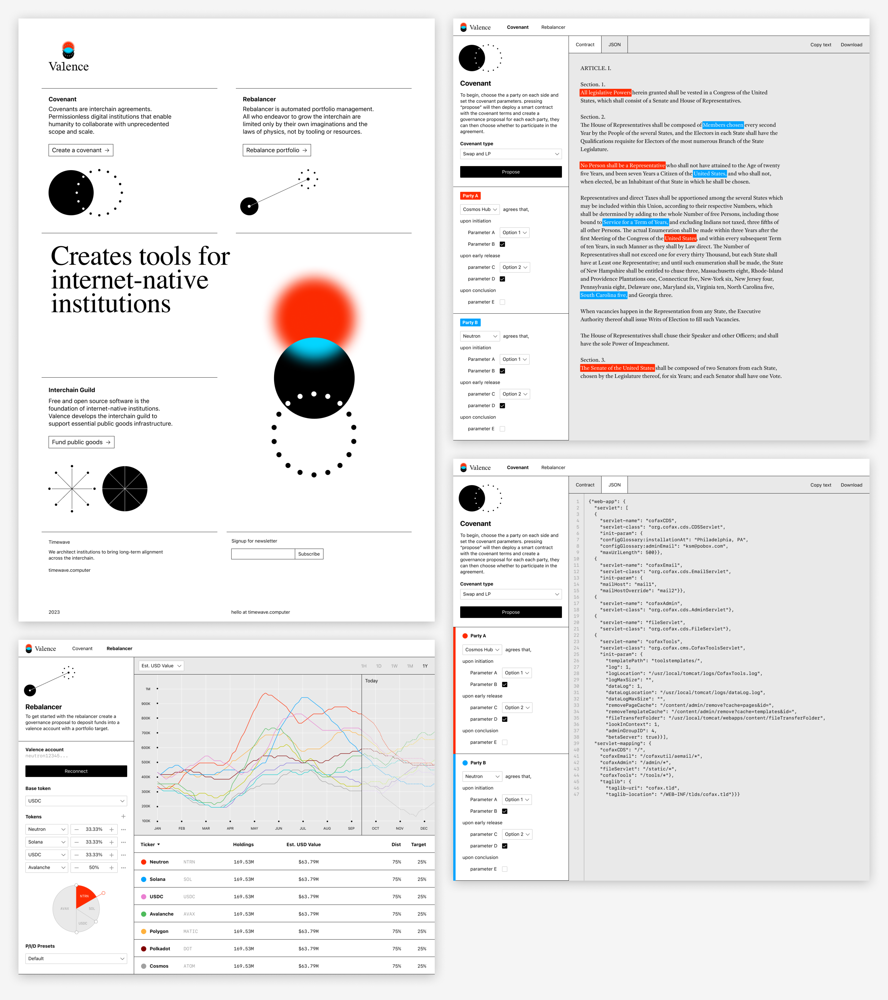
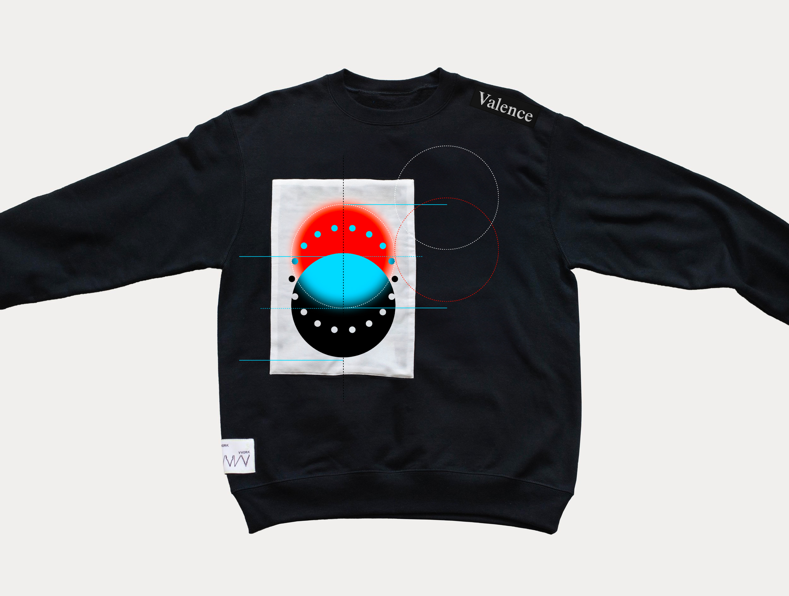

# Valence Brand Guide
1. **[Overview](#1-overview)**
2. **[Identity Elements](#2-identity-elements)**  
  a. [Blurred Red Circle](#a-blurred-red-circle)  
  b. [Black Circle](#b-black-circle)  
  c. [18 Moons](#c-18-moons)  
  d. [The Diagram](#d-the-diagram)  
  e. [Wordmark](#e-wordmark)
3. **[In Use](#3-in-use)**  
  a. [The Diagram Only](#a-the-diagram-only)  
  b. [Wordmark Only](#b-wordmark-only)  
  c. [Lockups](#c-lockups)  
  d. [On a darker background](#d-on-a-darker-background)  
  e. [Application without blur](#e-application-without-blur)
4. **[Colors](#4-colors)**  
  a. [Brand Colors](#a-brand-colors)  
  b. [Graphing Colors](#b-graphing-colors)
5. **[Typography](#5-typography)**  
  a. [Primary Typeface](#a-primary-typeface)  
  b. [Secondary Typeface](#b-secondary-typeface)  
  c. [Tertiary Typeface](#c-tertiary-typeface)
6. **[Sample Designs](#6-sample-designs)**  
  a. [Website mockups](#a-website-mockups)  
  b. [Team swag](#b-team-swag)
7. **[Contact](#7-contact)**

## 1. Overview
TKTK

## 2. Identity Elements
Valence brand's visual identity consists of three same size circles – [blurred red circle](#a-blurred-red-circle), [black circle](#b-black-circle), and [18 Moons](#c-18-moons). These circles make up [the diagram](#d-the-diagram), which can be used in conjunction with the [wordmark](#e-wordmark). Refer to [lockups](#c-lockups) section for detail.


### a. Blurred Red Circle

The blurred red circle is can be reproduced in Figma with [Layer Blur](https://help.figma.com/hc/en-us/articles/360041488473-Apply-shadow-or-blur-effects#layer-blur) function, with the amount to be set as 12.5% of the diameter. In SVG or CSS, the amount should be set as 6.25%. Below is an example when the circle is 400px in diameter:

| Diameter | Figma Layer Blur `12.5%` | SVG feGaussianBlur `6.25%` | CSS Blur `6.25%` |
| -------- | ------------------------ | -------------------------- | ---------------- |
| 400px    | 50                       | 25                         | 25               |

The blurred red circle in SVG:
```html
<svg width="500" height="500" xmlns="http://www.w3.org/2000/svg" xmlns:xlink="http://www.w3.org/1999/xlink">
  <circle cx="250" cy="250" r="200" fill="#FF2B00" filter="url(#blur)" />
  <filter id="blur" x="0" y="0" width="500" height="500" filterUnits="userSpaceOnUse" color-interpolation-filters="sRGB">
    <feGaussianBlur stdDeviation="25"/>
  </filter>
</svg>
```
The blurred red circle in HTML/CSS:
```html
<div class="blurred-red-circle"></div>
<style>
  .blurred-red-circle {
    width: 400px;
    height: 400px;
    background: #FF2B00;
    border-radius: 200px;
    filter: blur(25px);
  }
</style>
```

### b. Black Circle

The black circle should always appear in the same diameter as the blurred red circle, in solid pure black.

### c. 18 Moons

The third circle consists of 18 dots. Each dot (or moon) is drawn on the circular path of the same diameter as otehr circles, 20 degrees apart from each other. Each moon is 6.25% in size of the primary circle.


### d. The Diagram

The diagram is where the three identity elements overlap, which can be used as standalone element. See [In Use](#3-in-use) section for further detail. The blurred red circle and the black circle are positioned on top of another with 50% of their height overlapping. The overlapped area is represented in blue, [the opposite end of the specific red in HSL color space](#a-brand-colors). 18 moons are placed at the center of the composition with each moon colored as an opposite of its surrounding.


### e. Wordmark

Valence wordmark is a customized rendition of [Times](#a-primary), the primary typeface of the brand. Below is a diff of the Valence wordmark and the word 'Valence' set in Times. The wordmark can be used as standalone element. See [In Use](#3-in-use) section for further detail.


## 3. In Use

### a. The diagram only

The diagram can be used by itself to represent the Valence brand where appropriate.


Download [SVG](downloads/the-diagram-only.svg), [PNG](downloads/the-diagram-only.png)

### b. Wordmark only

The wordmark can be used by itself to represent the Valence brand where appropriate.


Download [SVG](downloads/wordmark-only.svg), [PNG](downloads/wordmark-only.png)

### c. Lockups

The diagram and wordmark can be locked up in two different ways. Horizontal lockup is preferred when there's limited surface amount to utilize. Vertical lockup is preferred for more official use.


Download [SVG](downloads/horizontal-lockup.svg), [PNG](downloads/horizontal-lockup.png)


Download [SVG](downloads/vertical-lockup.svg), [PNG](downloads/vertical-lockup.png)

### d. On a darker background

While it is not recommneded, all of the identity elements can be displayed on a darker background for a limited use. This includes the diagram, wordmark, and the lockups. The only important thing is that the color black needs to be substituted with white, giving the logo an 'inverted' look. Whenever possible, use the files provided below instead of altering colors of the existing assets.


Download:  
Inverted diagram only in [SVG](downloads/the-diagram-only-inverted.svg), [PNG](downloads/the-diagram-only-inverted.png)  
Inverted wordmark only in [SVG](downloads/wordmark-only-inverted.svg), [PNG](downloads/wordmark-only-inverted.png)  
Inverted horizontal lockup in [SVG](downloads/horizontal-lockup-inverted.svg), [PNG](downloads/horizontal-lockup-inverted.png)  
Inverted vertical lockup in [SVG](downloads/vertical-lockup-inverted.svg), [PNG](downloads/vertical-lockup-inverted.png)

### e. Application without blur

The blur of red and blue circles is a cruciual aspect of the Valence brand. The effect is meant to be carried out in different mediums as it is the most natural to the medium itself. For example for silk screened reproduction, a halftone screen might be considered. If there is absolutely no viable path to obtain a meaningful blur effect, solid circles without blur can be considered. The diagram with solid circles can be found here as [SVG](downloads/the-diagram-only-sans-blur.svg) or [PNG](downloads/the-diagram-only-sans-blur.png). 

## 4. Colors

### a. Brand colors

The red and blue of Valence primary colors are created using directly opposite colors in the HSL color space, each being shifted by 10 degrees. The red is adjusted to be 10° from zero degrees, representing a slight shift in hue from pure red. The blue color is also adjusted to be 10° away from 180 degrees, indicating the same shift from pure blue. The pure black is added to the set, making the three promary colors for Valence. These are the same colors used in the [blurred red circle](#a-blurred-red-circle), [black circle](#b-black-circle) and the overlapped area.

|                                                   | Name   | HSL             | RGB             | HEX       |
| ------------------------------------------------- | ------ | --------------- | --------------- | --------- |
|  | Red    | ` 10, 100,  50` | `255,  42,   0` | `#FF2A00` |
|  | Black  | `  0,   0,   0` | `  0,   0,   0` | `#000000` |
|  | Blue   | `190, 100,  50` | `  2, 213, 255` | `#02D5FF` |


### b. Graphing colors

A separate set of colors, primarily to differentiate different categories shown in charts and graphs, is defined as below. These colors are chosen for their perceptual distinctiveness and verbal describability. 

The color set is also designed to be used in order. If you want only four colors, the first four colors from the list can be used, as the colors at the top of the list are more identifiable. It is best practice to keep the number of colors to a minimum in a single chart.

Please note that while the red is the same red as the brand color, but the blue is different for better legibility.


```js
'#FF2A00' ,'#00A3FF' ,'#EA80D1' ,'#4EBB5B' ,'#FFBC57' ,'#800000' ,'#A0A0A0' ,'#C2C600' ,'#8476DE' ,'#17CFCF'
```

|                                                   | Name   | HSL             | RGB             | HEX       |
| ------------------------------------------------- | ------ | --------------- | --------------- | --------- |
|  | Red    | ` 10, 100,  50` | `255,  42,   0` | `#FF2A00` |
|  | Blue   | `202, 100,  50` | `  0, 163,  55` | `#00A3FF` |
|  | Pink   | `314,  71,  71` | `234, 128, 209` | `#EA80D1` |
|  | Green  | `127,  44,  52` | ` 87, 187,  91` | `#4EBB5B` |
|  | Yellow | ` 36, 100,  62` | `255, 177,  60` | `#FFBC57` |
|  | Brown  | `  0, 100,  25` | `128,   0,   0` | `#800000` |
|  | Gray   | `  0,   0,  63` | `160, 160, 160` | `#A0A0A0` |
|  | Olive  | ` 61, 100,  39` | `194, 198,   0` | `#C2C600` |
|  | Purple | `248,  61,  67` | `132, 118, 222` | `#8476DE` |
|  | Teal   | `180,  80,  45` | ` 23, 207, 207` | `#17CFCF` |

These are good to be used on a white, black or a light gray background as accent.

|                                                   | Name         | HSL             | RGB             | HEX       |
| ------------------------------------------------- | ------------ | --------------- | --------------- | --------- |
|  | White        | ` 10, 100,  50` | `255, 255, 255` | `#FFFFFF` |
|  | Black        | `202, 100,  50` | `  0,   0,   0` | `#000000` |
|  | Light gray   | `  0,   0,  91` | `233, 233, 233` | `#E9E9E9` |

## 5. Typography
### a. Primary typeface

The primary typeface for the Valence brand is Times, a classic typeface with a rich history. There are many digital variants of Times typeface, including Times (Linotype) included in macOS, and Times New Roman (Monotype) in Windows. While they are very similar and therefore interchangeable, the brand prefers Times (Linotype), the digitalized version of the typeface commissioned by the newspaper The Times.

The typeface can be used for brand messages and body text. However, for UI use, Times can be replaced with a font that has a slightly refined look, including Adobe Text Pro.


### b. Secondary typeface

The secondary typeface, to be used in conjunction with the primary, is Unica 77 by Lineto. Unica 77 is versatile enough to be used in UI applications. The license for Unica 77 can be obtained from [Lineto website](https://lineto.com/typefaces/unica77?font=L3l-qxAYPaV).


### c. Tertiary typeface

For a limited use, for visual clarity in numeric and code representation, the [monospaced variant of Unica 77](https://lineto.com/typefaces/unica77-mono?font=PDpITQJkbYI) can be used. Proper licenses to be obtained upon usage.


## 6. Sample designs
### a. Website mockups



Homepage [PNG](downloads/web-home.png), [PDF](downloads/web-home.pdf)  
Covenant (Contract view) [PNG](downloads/web-covenant-contract.png), [PDF](downloads/web-covenant-contract.pdf)  
Covenant (JSON view) [PNG](downloads/web-covenant-json.png), [PDF](downloads/web-covenant-json.pdf)  
Rebalancer [PNG](downloads/web-rebalancer.png), [PDF](downloads/web-rebalancer.png)

### b. Team swag

TKTK


## 7. Contact
For inquiries, please contact TKTK.